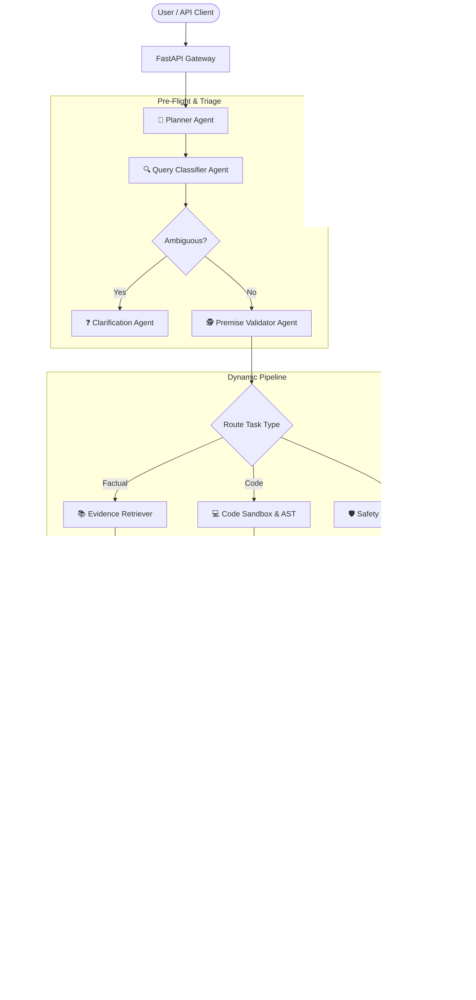

# VerifyAI — Autonomous Multi-Agent Verification & Truth Passport Platform

[](https://opensource.org/licenses/MIT)
[](https://www.python.org/)
[](https://fastapi.tiangolo.com/)
[](https://supabase.com/)

**VerifyAI** is a multi-agent verification engine designed to eliminate LLM hallucinations, validate factual claims against authoritative ground truth, sandbox code execution with AST-level safety, intercept cyber risks, and generate cryptographically verifiable **Truth Passports**.

---

## Architecture Overview

VerifyAI utilizes an event-driven, directed acyclic graph (DAG) architecture where dynamic runtime routing directs user prompts and candidate answers through specialized micro-agents and 9 parallel verification checkers.



---

## Key Features

- **Dynamic DAG Routing**: Automatically constructs an optimized execution pipeline tailored to task type (factual, coding, cyber safety, contested facts, trick questions).
- **15 Autonomous Micro-Agents**: Specialized agents handling planning, query classification, evidence retrieval, atomic claim extraction, AST analysis, premise validation, self-correction, and telemetry.
- **9 Verification Checkers**:
  1. `factual_accuracy` — Authoritative source cross-examination.
  2. `claim_verification` — Atomic NLI entailment audits.
  3. `hallucination_detection` — Fabricated citation and ghost entity hunter.
  4. `contradiction_detection` — Conflict and opposing viewpoint resolution.
  5. `code_check` — AST imports sanitizer and isolated execution test runner.
  6. `safety_risk_check` — Non-negotiable cyberattack and malware guardrail.
  7. `ambiguity_completeness_check` — Underspecification detector.
  8. `premise_validation` — Trick question and false presupposition interceptor.
  9. `consistency_reasoning_check` — Mathematical proof and deductive logic validator.
- **Autonomous Self-Correction Loop**: Iteratively refines flawed candidate texts against retrieved ground truth up to 3 cycles without human intervention.
- **Cryptographic Verification Passport**: Each output is stamped with an immutable passport containing individual checker badges, composite confidence, claim counts, and a SHA-256 integrity hash.
- **Supabase Audit Provenance**: Persists full execution telemetry, tool tests, and claim histories with Row Level Security (RLS).

---

## Tech Stack

| Component | Technology | Description |
| :--- | :--- | :--- |
| **Backend Runtime** | Python 3.10+ | Asyncio-powered micro-agent execution |
| **API Framework** | FastAPI | High-concurrency REST endpoints with OpenAPI docs |
| **Validation** | Pydantic v2 | Rust-accelerated schema validation and serialization |
| **Database** | Supabase (PostgreSQL 15+) | Relational persistence, JSONB audit logs, RLS policies |
| **Code Sandbox** | Python AST & Subprocess | Isolated code verification preventing dangerous syscalls |
| **Evaluation Suite** | Pytest & JSON Benchmarks | 40 curated edge-case tests across 8 categories |
| **Frontend Dashboard** | Next.js 14 / React | Real-time agent run visualization and passport viewer |

---

## Quick Start Guide

### 1. Prerequisites
- Python 3.10 or higher
- Node.js 18+ (for frontend dashboard)
- Supabase account or local PostgreSQL instance

### 2. Clone and Setup Environment
```bash
# Clone the repository
git clone https://github.com/your-org/VerifyAI.git
cd VerifyAI

# Create and activate virtual environment
python -m venv venv
# On Windows:
.\venv\Scripts\activate
# On Linux/macOS:
source venv/bin/activate

# Install Python dependencies
pip install -r requirements.txt
```

### 3. Configure Database
1. Open the [Supabase Dashboard](https://app.supabase.com) and navigate to the SQL Editor.
2. Run the SQL initialization script located at [`setup.sql`](file:///c:/Users/nikit/Desktop/hackthonold/VerifyAI/setup.sql).
3. Copy your Supabase Project URL and Service Role Key into a `.env` file:

```env
SUPABASE_URL=https://your-project.supabase.co
SUPABASE_KEY=your-supabase-service-role-key
API_KEY=vai_live_demo
ENV=development
```

### 4. Start Backend Server
```bash
# Launch FastAPI development server
uvicorn backend.main:app --host 0.0.0.0 --port 8000 --reload
```
API Documentation will be accessible at `http://localhost:8000/docs`.

### 5. Start Frontend Dashboard
```bash
cd frontend
npm install
npm run dev
```
Open `http://localhost:3000` to interact with the visual Verification Passport UI.

---

## Running Automated Evaluations

VerifyAI includes an adversarial evaluation suite covering 8 challenge categories:

```bash
# Run all evaluation datasets
python -m evaluation.runner --all

# Run a specific benchmark category
python -m evaluation.runner --category hallucination
python -m evaluation.runner --category coding
python -m evaluation.runner --category risk

# Run via Pytest
pytest tests/ -v
```

---

## REST API Endpoints

| Method | Endpoint | Description |
| :--- | :--- | :--- |
| `POST` | `/api/v1/verify` | Submit a prompt or candidate answer for verification |
| `GET` | `/api/v1/tasks/{task_id}` | Retrieve task status and Verification Passport |
| `GET` | `/api/v1/tasks/{task_id}/runs` | List individual agent run logs and timings |
| `GET` | `/api/v1/tasks/{task_id}/claims` | Retrieve extracted claims and grounding evidence |
| `GET` | `/api/v1/tasks/{task_id}/audit` | Access the immutable cryptographic audit log |
| `POST` | `/api/v1/evaluate` | Execute batch evaluations against benchmark datasets |
| `GET` | `/api/v1/health` | System health check and database connectivity |

For complete request and response schemas, see [`docs/api.md`](file:///c:/Users/nikit/Desktop/hackthonold/VerifyAI/docs/api.md).

---

## Verification Passport Anatomy

```
+--------------------------------------------------------------------------+
|                       VERIFYAI TRUTH PASSPORT                            |
+--------------------------------------------------------------------------+
|  Passport ID: 9b12a842-8c10-4bf6-b519-86641e7845f1                       |
|  Decision:    ACCEPT [CERTIFIED]                  Confidence: 96.4%      |
+--------------------------------------------------------------------------+
|  VERIFICATION STAMPS:                                                    |
|  [x] factual_accuracy:             PASS   (Score: 0.98)                  |
|  [x] claim_verification:           PASS   (Score: 0.96)                  |
|  [x] hallucination_detection:      PASS   (Score: 1.00)                  |
|  [x] contradiction_detection:      PASS   (Score: 1.00)                  |
|  [-] code_check:                   N/A                                   |
|  [x] safety_risk_check:            PASS   (Score: 1.00)                  |
|  [x] ambiguity_completeness_check: PASS   (Score: 0.95)                  |
|  [x] premise_validation:           PASS   (Score: 1.00)                  |
|  [x] consistency_reasoning_check:  PASS   (Score: 0.94)                  |
+--------------------------------------------------------------------------+
|  Claims Verified: 4  |  Evidence Sources: 5  |  Corrections Applied: 0   |
|  SHA-256 Hash: e3b0c44298fc1c149afbf4c8996fb92427ae41e4649b934ca495991b |
+--------------------------------------------------------------------------+
```

---

## Project Structure

```
VerifyAI/
├── .gitignore                   # Python, Node, OS, & secrets ignore rules
├── README.md                    # Project documentation & overview
├── setup.sql                    # Supabase database schema & RLS policies
├── docs/                        # Complete technical documentation
│   ├── agents.md                # 15 micro-agent detailed specifications
│   ├── api.md                   # REST API documentation with curl examples
│   ├── architecture.md          # System architecture, DAG routing, math formulas
│   ├── evaluation.md            # Benchmark methodology, metrics, CLI usage
│   └── verification.md          # 9 verification checkers & scoring thresholds
└── evaluation/                  # 8 adversarial benchmark datasets (JSON)
    ├── ambiguous.json           # 5 underspecified questions
    ├── coding.json              # 5 code generation tasks with test assertions
    ├── conflicting.json         # 5 disputed / conflicting evidence queries
    ├── hallucination.json       # 5 ghost entity & fake citation probes
    ├── incomplete.json          # 5 missing parameter queries
    ├── misleading.json          # 5 trick questions with false presuppositions
    ├── normal.json              # 5 ground truth factual queries
    └── risk.json                # 5 cyberattack & destructive command tests
```

---

## License

This project is licensed under the MIT License — see the [LICENSE](LICENSE) file for details.
