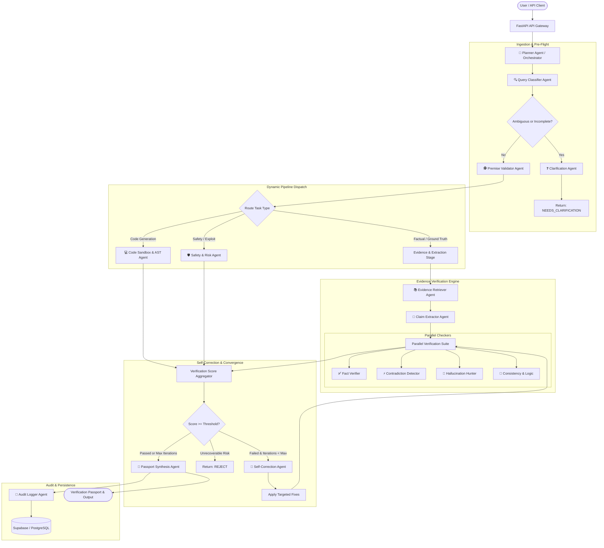
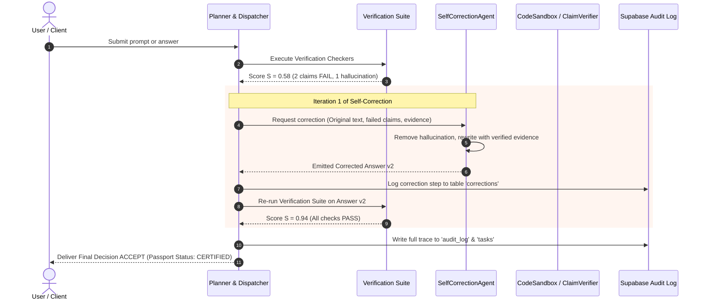
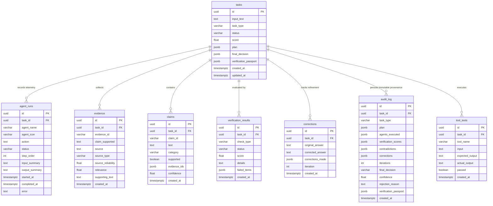

# VerifyAI System Architecture

VerifyAI is an enterprise-grade autonomous multi-agent verification and truth passport system designed to eliminate AI hallucinations, validate claims against authoritative ground truth, enforce strict security and safety guardrails, and execute iterative self-correction loops.

---

## 1. High-Level System Architecture

VerifyAI employs an event-driven, directed acyclic graph (DAG) multi-agent architecture with dynamic runtime routing, parallel checker execution, AST-isolated sandboxing, and autonomous self-correction.



---

## 2. Multi-Agent Pipeline Explanation

VerifyAI splits complex verification into specialized, decoupled micro-agents. Every agent receives strongly-typed Pydantic schemas, emits telemetry to `agent_runs`, and guarantees deterministic local fallback execution if upstream external APIs or search tools are unavailable.

```
+-----------------------------------------------------------------------------------+
|                              MULTI-AGENT PIPELINE                                 |
+-------------------+---------------------------------------+-----------------------+
| Pipeline Stage    | Agents Involved                       | Key Responsibilities  |
+-------------------+---------------------------------------+-----------------------+
| 1. Ingestion      | PlannerAgent, QueryClassifierAgent    | Intent identification |
| 2. Pre-Flight     | ClarificationAgent, PremiseValidator  | Ambiguity & tricks    |
| 3. Evidence Gathering | EvidenceRetrieverAgent, ClaimExtractor| Retrieval & grounding |
| 4. Verification   | FactVerifier, Contradiction, Hallucination, CodeSandbox, Safety | Parallel audits |
| 5. Self-Correction| SelfCorrectionAgent, PlannerAgent     | Iterative refinement  |
| 6. Certification  | PassportSynthesisAgent, AuditLogger   | Passport & telemetry  |
+-------------------+---------------------------------------+-----------------------+
```

### Execution Lifecycle Stages:

1. **Planning & Classification**:
   - The user query is tokenized and analyzed by `QueryClassifierAgent`.
   - The query is tagged with a `task_type` (`factual`, `ambiguous`, `incomplete`, `conflicting`, `misleading`, `hallucination`, `coding`, `security_risk`).
   - `PlannerAgent` constructs a customized DAG execution plan containing required steps, timeout ceilings, and dependencies.

2. **Pre-Flight Sanity Checks**:
   - If missing variables or context are detected, `ClarificationAgent` halts execution and outputs targeted clarifying questions.
   - If false presuppositions exist (e.g. "Moses on the Ark"), `PremiseValidatorAgent` corrects the premise upfront or flags the query as misleading.

3. **Evidence Retrieval & Claim Extraction**:
   - For factual or contested queries, `EvidenceRetrieverAgent` queries trusted vector indexes, search APIs, or Wikipedia/scientific databases.
   - `ClaimExtractorAgent` decomposes the candidate text into atomic, testable propositional claims (subject-predicate-object tuples).

4. **Multi-Vector Verification Suite**:
   - Each claim is audited across 9 orthogonal verification checkers simultaneously.
   - Code inputs are dispatched to `CodeSandboxAgent` for Python AST parsing and safe subprocess execution tests.
   - Risk requests are dispatched to `SafetyRiskAgent` for jailbreak and destructive action detection.

5. **Autonomous Self-Correction**:
   - If verification score $S < 0.85$, and contradictions or unsupported claims exist, the pipeline invokes `SelfCorrectionAgent`.
   - The agent rewrites the answer using the retrieved evidence, fixing hallucinations while preserving factual parts.
   - Re-verified up to 3 iterations or until confidence converges.

6. **Passport Generation & Audit Logging**:
   - `PassportSynthesisAgent` compiles the cryptographic Verification Passport.
   - `AuditLoggerAgent` writes the complete trace to Supabase.

---

## 3. Dynamic Routing Architecture

VerifyAI does not use a static sequential chain. It implements dynamic runtime routing based on early signals discovered during classification and pre-flight evaluation.

```
                           +----------------------+
                           | User Query Ingestion |
                           +----------+-----------+
                                      |
                                      v
                          +------------------------+
                          |  QueryClassifierAgent  |
                          +-----------+------------+
                                      |
         +----------------------------+----------------------------+
         |                            |                            |
         v                            v                            v
 [Factual / Science]           [Coding Task]              [Dangerous Task]
         |                            |                            |
         v                            v                            v
Retriever -> ClaimExtractor     AST Parser -> Sandbox        Safety Guardrail -> Audit
         |                            |                            |
         v                            v                            v
Fact & Hallucination Verifiers  Syntax & Assertion Runner    Instant REJECT / Mitigate
```

### Routing Rules Engine:

| Condition | Primary Route | Skipped Agents | Target Decision |
| :--- | :--- | :--- | :--- |
| `is_underspecified == True` | `ClarificationAgent` | Retrieval, Sandbox, FactVerifier | `NEEDS_CLARIFICATION` |
| `contains_false_premise == True` | `PremiseValidator` $\rightarrow$ `SelfCorrection` | EvidenceRetriever (full) | `CORRECTED` or `REJECT` |
| `task_type == "coding"` | `CodeSandboxAgent` $\rightarrow$ `SafetyRisk` | EvidenceRetriever, ClaimExtractor | `ACCEPT` (if tests pass) |
| `risk_level >= HIGH` | `SafetyRiskAgent` $\rightarrow$ `AuditLogger` | CodeSandbox, FactVerifier | `REJECT` |
| `conflicting_evidence == True` | `ContradictionDetector` $\rightarrow$ `SelfCorrection` | CodeSandbox | `WARNING` or `CORRECTED` |
| `ground_truth_available == True` | Full Verification Matrix | CodeSandbox | `ACCEPT` |

---

## 4. Self-Correction Loop

When a generated response contains factual inaccuracies, hallucinations, or unverified assertions, VerifyAI does not fail the task immediately. Instead, it triggers an iterative **Refinement Loop**.



### Convergence Criteria:
- **Success Termination**: Verification score $S \ge 0.85$ and zero high-severity flags.
- **Maximum Iteration Ceiling**: A hard limit of 3 iterations prevents infinite loops and token exhaustion.
- **Plateau Detection**: If $|S_{t} - S_{t-1}| \le 0.02$ between successive iterations without passing, the system terminates and issues a decision of `WARNING` or `REJECT` with actionable explanations.

---

## 5. Confidence Scoring System

VerifyAI implements a rigorous mathematical confidence scoring engine. Rather than relying on LLM self-confidence (which suffers from severe overconfidence), the system computes an empirical composite score based on claim support and verification penalties.

### Mathematical Formulation:

$$\text{Confidence} = \max\left(0.0, \, \min\left(1.0, \, C_{\text{claims}} \times \prod_{i=1}^{9} \left(1 - p_i\right) \right)\right)$$

Where:
- $C_{\text{claims}}$ is the claim support ratio:
  $$C_{\text{claims}} = \frac{1}{\sum_{k} w_k} \sum_{k=1}^{M} w_k \cdot \text{Support}(c_k)$$
  $w_k$ denotes the importance weight of claim $k$, and $\text{Support}(c_k) \in [0.0, 1.0]$.
- $p_i$ is the penalty weight of checker $i$:
  - `hallucination_detection`: penalty $p = 0.40$ if triggered.
  - `safety_risk_check`: penalty $p = 0.95$ if triggered.
  - `contradiction_detection`: penalty $p = 0.25$ if triggered.
  - `code_execution_failure`: penalty $p = 0.50$ if triggered.
  - `premise_invalid`: penalty $p = 0.30$ if triggered.
  - `ambiguity`: penalty $p = 0.35$ if triggered.

### Decision Boundaries:

```
[0.00 ................. 0.45 ................. 0.70 ................. 0.85 ................. 1.00]
     |     REJECT      |     WARNING         |   CORRECTED / PASS   |       CERTIFIED ACCEPT     |
```

- **$\ge 0.85$**: **ACCEPT** — Fully grounded, zero unmitigated contradictions, certified truthful.
- **$0.70 - 0.84$**: **CORRECTED** or **WARNING** — Refined successfully, or acceptable with cautionary notes.
- **$0.45 - 0.69$**: **NEEDS_CLARIFICATION** or **WARNING** — Ambiguous inputs or conflicting domain consensus.
- **$< 0.45$**: **REJECT** — Fabrications, ungrounded hallucinations, or severe risk violations.

---

## 6. Database Schema Overview

The database is built on Supabase (PostgreSQL 15+) with Row Level Security (RLS) enabled.



---

## 7. Technology Stack

| Layer | Component | Technology | Rationale |
| :--- | :--- | :--- | :--- |
| **API Runtime** | ASGI Web Server | FastAPI + Uvicorn | High-throughput asynchronous endpoints with native OpenAPI validation |
| **Type Validation** | Schema Enforcer | Pydantic v2 | Sub-millisecond Rust-based model parsing, JSON schema generation |
| **Agent Core** | Orchestration | Python 3.10+ Asyncio | True asynchronous concurrent execution across checker agents |
| **Persistence** | Database & Storage | Supabase / PostgreSQL 15 | Relational ACID guarantees with JSONB indexing and Row Level Security |
| **Code Sandbox** | Safe Execution | Python `ast` + Subprocess Isolation | Prevents dangerous system calls, network access, or infinite recursion |
| **Testing & Eval** | Test Harness | Pytest + JSON Test Datasets | Standardized automated benchmarking across 8 real-world task categories |
| **Client UI** | Web Dashboard | Next.js 14 / React / Tailwind CSS | Real-time agent trace visualization and passport verification UI |
